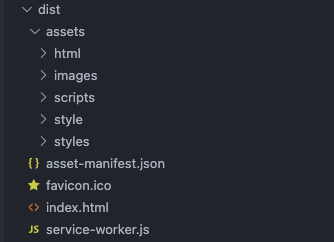
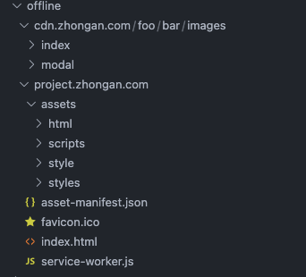

# dm-offline-webpack-plugin

把目录打包成离线缓存要求的目录结构

### 安装

```bash
npm install -D @dm/offline-webpack-plugin
```

### 使用

在你的 webpack 配置中追加一个 plugin：

```js
const { DMOfflineWebpackPlugin } = require('@dm/offline-webpack-plugin');

new DMOfflineWebpackPlugin({
    // 源目标，默认dist
    src: 'dist',
    // 目标文件名，默认 offline （会生成一个offline.zip）
    zipFileName: 'offline',
    // 当前项目所在域名，不需要schema，可有子路径，例如：project.zhongan.com/foo/bar
    destUrl: 'project.zhongan.com',
    // dist目录的子文件映射表
    mapping: [
        {
            src: 'assets/images',
            destUrl: 'cdn.zhongan.com/foo/bar/images',
        },
    ],
});
```

### 举个栗子

以上述配置为例

dist 目录：



生成的 offline 目录：


